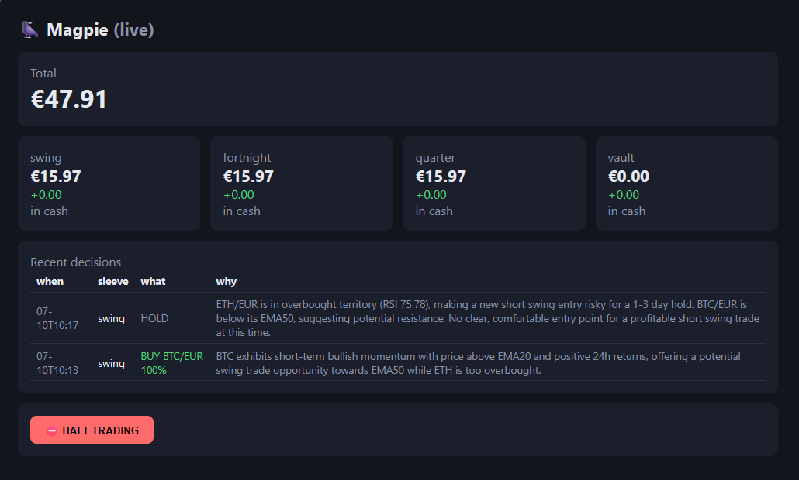

# 🐦‍⬛ Magpie

[](https://github.com/colfin22/magpie/actions/workflows/ci.yml)
[](LICENSE)

An autonomous, self-hosted crypto trading bot with an LLM for a brain. You give it
a small stake on Kraken and a Gemini API key; it manages the money on its own
schedule, keeps a full written diary of every thought, and pushes you a daily
digest. Your only control is the halt button — by design.

> **⚠️ This is an experiment, not a product.** An LLM has no proven trading edge.
> Magpie is built for people who want to *watch an AI manage a toy stake* with
> real rails around it — not for money you can't afford to lose. Expect anything
> from slow bleed to pleasant surprise. The house always takes 0.4% a trade.

<p align="center">
  
</p>

## How it thinks

Four **sleeves**, each an independent sub-portfolio with its own books, its own
mandate, and its own decision cadence:

| Sleeve | Horizon | Decides | Funded by |
|---|---|---|---|
| **swing** | ~1–3 days | every 6 h | ⅓ of the stake |
| **fortnight** | 1–2 weeks | daily | ⅓ of the stake |
| **quarter** | weeks–3 months | Mondays | ⅓ of the stake |
| **vault** | a year+ | 1st of month | **profits only** |

Each decision cycle, the engine builds a context pack — that sleeve's holdings,
market data with computed indicators (EMA 20/50/200, RSI, multi-horizon returns),
its own recent decision history, and a fee reminder — and asks Gemini for a
strict-JSON decision: buy / sell / hold, pair, fraction, confidence, reasoning.

**The validation layer is the real boundary**: only whitelisted pairs, spot only,
long only, exchange minimums enforced, balances reconciled — and any malformed,
out-of-universe or errored answer resolves to HOLD. The model's words never touch
the exchange; only validated orders do.

**The vault** starts empty. Whenever an active sleeve's value exceeds its
high-water mark, half of the *realised* profit (EUR actually banked, not paper
gains) is skimmed into the vault, and the mark ratchets up. The vault accumulates
long-term positions out of house winnings only — losing sleeves are never
refilled from it.

**Top-ups:** deposit more EUR to the exchange whenever you like. The bot notices
the surplus at its next cycle, splits it equally across the three active sleeves,
and raises their high-water marks so fresh cash is never mistaken for profit.

## Safety rails (the non-negotiables)

- **The API key cannot withdraw.** Create it with query + trade permissions only.
  Worst-case compromise of the box = bad trades, never stolen funds. (The repo's
  verification snippet in `docs/` probes this.)
- **It can never deposit** — there is no payment integration. The stake you fund
  is the ceiling.
- **Spot only, long only, whitelisted pairs only** — no leverage, no derivatives,
  no liquidations.
- **Kill switch**: `POST /api/halt` (or the big red button on the dashboard)
  stops all ordering until `POST /api/resume`.
- **Total auditability**: every prompt sent to the model and every raw response
  is stored. The dashboard diary shows what it saw, what it thought, and what it
  did — for every cent that moves.

There is deliberately **no auto-stop-loss and no position cap** — the operator
takes the risk knowingly and holds the halt button. Add your own guardrails if
that's not your temperament.

## Run

**You need:** Docker, a [Kraken](https://kraken.com) account with a funded EUR
balance, a trade-only API key (see above), and a
[Gemini API key](https://aistudio.google.com/apikey) (free tier is plenty —
the bot makes a handful of calls a day).

```
cp .env.example .env     # fill in the two keys; leave TRADING_ENABLED=false
docker compose up -d --build
```

The bot starts in **paper mode**: identical code path, live market data,
simulated fills against a pretend stake. Watch the diary at `http://<host>:8000`
until you trust it, then set `TRADING_ENABLED=true` and recreate the container.
At its first live cycle it treats your entire exchange EUR balance as the opening
top-up and splits it across the sleeves.

Schedule the heartbeat (systemd timer or cron):

```
0 0,6,12,18 * * *  curl -s -X POST http://localhost:8000/api/cycle
5 18 * * *         curl -s -X POST http://localhost:8000/api/digest
```

The cycle endpoint is safe to call at any hour — sleeve cadences are gated
internally (fortnight only acts on the 06:00 call, quarter on Monday's, the
vault on the 1st of the month).

## API

- `GET /health` — liveness, mode, halt state, last decision
- `GET /api/state` — full portfolio, sleeve breakdown, decision diary, skims
- `POST /api/cycle` — run a decision tick
- `POST /api/digest` — push the daily summary
- `POST /api/halt` / `POST /api/resume` — the only human controls
- `POST /api/topup?amount=` — paper mode only; live deposits are auto-detected

## Configuration

Everything is env vars — see [`.env.example`](.env.example). Notables:
`PAIRS` (the tradeable universe, default BTC/EUR + ETH/EUR), `SKIM_FRACTION`
(profit share skimmed to the vault, default 0.5), `GEMINI_MODEL`,
`HA_URL`/`HA_TOKEN`/`HA_NOTIFY_SERVICE` (optional Home Assistant pushes for
trades, top-ups and the daily digest).

## Licence

MIT.
