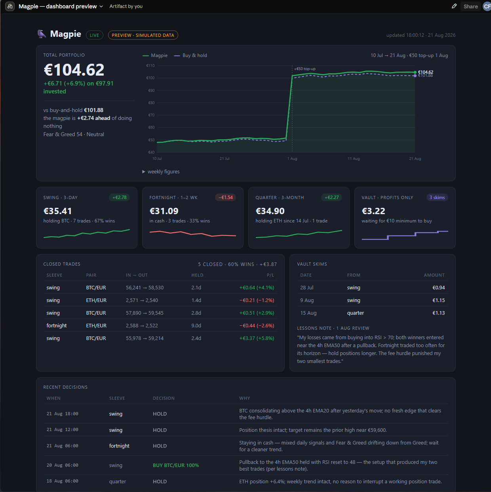

# 🐦‍⬛ Magpie

[](https://github.com/colfin22/magpie/releases)
[](https://github.com/colfin22/magpie/actions/workflows/ci.yml)
[](LICENSE)

An autonomous, self-hosted crypto trading bot with an LLM for a brain. You give it
a small stake on Kraken and an API key for the LLM of your choice; it manages the
money on its own schedule, keeps a full written diary of every thought, and pushes
you a daily digest. Your only control is the halt button — by design.

> **⚠️ This is an experiment, not a product.** An LLM has no proven trading edge.
> Magpie is built for people who want to *watch an AI manage a toy stake* with
> real rails around it — not for money you can't afford to lose. Expect anything
> from slow bleed to pleasant surprise. The house always takes 0.4% a trade.

👉 **New to this, or on Windows?** Jump to the step-by-step **[Windows guide](docs/WINDOWS.md)** — install to uninstall, no coding needed.

<p align="center">
  
  <br><sub>Dashboard a few months in: the <b>leaderboard</b> ranks the brain against its control arms — a dumb EMA rule, a DCA, a coin flip and doing nothing — while <b>"Was it right?"</b> grades every call at its horizon and asks whether the model's confidence means anything. Simulated preview data; a fresh install starts humbler.</sub>
</p>

## How it thinks

Four **sleeves**, each an independent sub-portfolio with its own books, its own
mandate, and its own decision cadence:

| Sleeve | Horizon | Decides | Funded by |
|---|---|---|---|
| **swing** | ~1–3 days | every 6 h | ⅓ of the stake |
| **fortnight** | 1–2 weeks | daily | ⅓ of the stake |
| **quarter** | weeks–3 months | Mondays | ⅓ of the stake |
| **vault** | a year+ | 1st of month | **profits only** |

Each decision cycle, the engine builds a context pack — that sleeve's holdings,
market data with computed indicators (EMA 20/50/200, RSI, multi-horizon returns),
its own recent decision history, and a fee reminder — and asks its LLM for a
strict-JSON decision: buy / sell / hold, pair, fraction, confidence, reasoning.

**The validation layer is the real boundary**: only whitelisted pairs, spot only,
long only, exchange minimums enforced, balances reconciled — and any malformed,
out-of-universe or errored answer resolves to HOLD. The model's words never touch
the exchange; only validated orders do.

**The vault** starts empty. Whenever an active sleeve's value exceeds its
high-water mark, half of the *realised* profit (EUR actually banked, not paper
gains) is skimmed into the vault, and the mark ratchets up. The vault accumulates
long-term positions out of house winnings only — losing sleeves are never
refilled from it.

**It learns from itself.** Once a month it re-reads its own diary — every
decision, what it reasoned at the time, and what actually happened — and writes
itself a lessons note that is injected into all future prompts. The only memory
it carries forward is the one it earns.

**It trades like a local.** Orders go in as post-only limits at the touch
(maker fee ~0.25%) with a patient window before falling back to market
(~0.40%) — a guaranteed saving on every fill that patience can win. Decisions
see daily *and* 4-hour indicators, the live spread, and the Crypto Fear & Greed
index; the slow sleeves think with a stronger model than the fast ones.

**It keeps score against a hodler.** From its first sight of capital it tracks a
phantom buy-and-hold portfolio of the same money (topped up in lockstep) — the
dashboard and daily digest always show whether the AI is beating doing nothing,
and the monthly self-review is confronted with the number. Closed trades are
FIFO-paired into round trips (win rate, average win/loss, hold time), and a
nightly reconciliation keeps the virtual sleeve books honest against real
exchange balances.

**Top-ups:** deposit more EUR to the exchange whenever you like. The bot notices
the surplus at its next cycle, splits it equally across the three active sleeves,
and raises their high-water marks so fresh cash is never mistaken for profit.

## The brain — pick your LLM

Magpie isn't wed to one model. `LLM_PROVIDER` chooses who makes the call:

| Provider | `LLM_PROVIDER` | API key from |
|---|---|---|
| **Gemini** (Google) — default | `gemini` | [aistudio.google.com](https://aistudio.google.com/apikey) |
| **OpenAI** (ChatGPT) | `openai` | platform.openai.com |
| **Anthropic** (Claude) | `anthropic` | console.anthropic.com |
| **Perplexity** | `perplexity` | perplexity.ai → API |
| **Grok** (xAI) | `grok` | x.ai |
| **DeepSeek** | `deepseek` | platform.deepseek.com |
| **GitHub Models** (Copilot) | `github` | github.com personal access token |
| **OpenRouter** — one key, any model above and more | `openrouter` | openrouter.ai |

Each provider uses its own key — set the one for the brain you pick. The prompt
and the strict-JSON safety layer are identical whichever model answers, so a
model that formats badly simply resolves to HOLD. `LLM_MODEL` / `LLM_MODEL_DEEP`
override the per-provider default models (the deep one runs the slow sleeves and
the monthly self-review; the fast one runs the rest). Switch live from the
settings page — dropdown, key, **Test active brain**, save; no restart.

> A paid ChatGPT / Perplexity / Copilot **subscription is not an API key** —
> each needs a developer key from the provider's platform, billed per token.
> Gemini's free tier is enough to run Magpie outright.

## The books

The ledger records **what the exchange actually settled** — the filled amount, the average
price it really got, and the fee it really charged — not what the bot assumed would happen.
That distinction matters more than it sounds: Kraken gives you the full amount you bought and
charges the fee *on top*, so a bot that models the fee instead of reading it disagrees with
reality on every single trade, and the difference gets quietly laundered into the nightly
reconcile as anonymous "drift". Drift absorption is meant to be the exception, not the
accounting.

Paper and shadow modes mirror the same fee convention, so a simulated arm is playing the same
game as the live bot rather than a slightly easier one.

Every stamp on the dashboard is shown on **your** clock (`TIMEZONE`) — the same clock the
decision slots run on.

## Safety rails (the non-negotiables)

- **The API key cannot withdraw.** Create it with query + trade permissions only.
  Worst-case compromise of the box = bad trades, never stolen funds. (The repo's
  verification snippet in `docs/` probes this.)
- **It can never deposit** — there is no payment integration. The stake you fund
  is the ceiling.
- **Spot only, long only, whitelisted pairs only** — no leverage, no derivatives,
  no liquidations.
- **Kill switch**: `POST /api/halt` (or the big red button on the dashboard)
  stops all ordering until `POST /api/resume`.
- **Total auditability**: every prompt sent to the model and every raw response
  is stored. The dashboard diary shows what it saw, what it thought, and what it
  did — for every cent that moves.

- **Stop-losses, if you want them** (`STOP_LOSS_ENABLED`, off by default): a
  protective sell rests **at the exchange**, so it still works when the bot does
  not — see [Stop-losses](#stop-losses-optional).

There is deliberately **no position cap and no circuit breaker** — no rule that
halts the strategy after a bad run. The operator takes the risk knowingly and
holds the halt button. Add your own guardrails if that's not your temperament.

## Run

**You need:** Docker, a **dedicated [Kraken](https://kraken.com) account that
holds only the money you want Magpie to manage**, a trade-only API key (see
above), and an API key for one supported LLM — **Gemini** is the default and its
[free tier](https://aistudio.google.com/apikey) is plenty to start (the bot makes
only a handful of calls a day). See [The brain](#the-brain--pick-your-llm) for the
alternatives.

> **⚠️ Use an empty Kraken account.** On its first live cycle Magpie treats the
> *entire* balance of the account as its starting stake and splits it across the
> sleeves, and its nightly reconciliation pulls any coin sitting on the account
> into its own books. So fund a **fresh account with nothing else in it** — just
> the stake you're giving Magpie. Don't point it at an account holding coins or
> cash you don't want it trading.

```
cp .env.example .env     # fill in your Kraken + LLM keys; leave TRADING_ENABLED=false
docker compose up -d --build
```

The bot starts in **paper mode**: identical code path, live market data,
simulated fills against a pretend stake. Watch the diary at `http://<host>:8000`
until you trust it, then set `TRADING_ENABLED=true` and recreate the container.
At its first live cycle it treats your entire exchange EUR balance as the opening
top-up and splits it across the sleeves.

Schedule the heartbeat (systemd timer or cron):

```
0 0,6,12,18 * * *  curl -s -X POST http://localhost:8000/api/cycle
5 18 * * *         curl -s -X POST http://localhost:8000/api/digest
45 5 * * *         curl -s -X POST http://localhost:8000/api/reconcile
30 5 1 * *         curl -s -X POST http://localhost:8000/api/review
```

The cycle endpoint is safe to call at any hour — sleeve cadences are gated
internally (fortnight only acts on the 06:00 call, quarter on Monday's, the
vault on the 1st of the month).

## Running on Windows

Magpie runs anywhere Docker does. **On Windows — or if you're not very technical — follow the complete step-by-step [Windows guide](docs/WINDOWS.md):** install, run, schedule, go live, update and uninstall, all click-by-click with no coding.

## API

- `GET /health` — liveness, mode, halt state, last decision
- `GET /api/state` — full portfolio, sleeve breakdown, decision diary, skims
- `POST /api/cycle` — run a decision tick
- `POST /api/digest` — push the daily summary
- `POST /api/review` — run the monthly self-review (writes the lessons note)
- `POST /api/reconcile` — absorb drift between the sleeve books and exchange reality
- `GET /settings` — a page to enter/change keys and Home Assistant details (secrets masked; test buttons for each integration). Web-entered settings persist and override the env.
- `POST /api/halt` / `POST /api/resume` — the only human controls
- `GET /api/arms` — the leaderboard: the bot, every shadow arm, and the phantom hodler
- `GET /api/stops` — resting stop-losses (real orders at the exchange, in live mode)
- `POST /api/stops/cancel` — clear every resting stop (a halt deliberately does *not*)
- `POST /api/topup?amount=` — paper mode only; live deposits are auto-detected

## Configuration

**Base currency.** Magpie trades against and values everything in one currency —
EUR by default, or USD, GBP, etc. It's a **one-time choice at initial setup**
(Settings → Base currency): the moment you set it — and automatically once the bot
has traded — it **locks permanently**, because switching it on a funded account
would leave your holdings and exchange balance in the wrong currency. Choose it
before funding.

**Timezone.** Set `TIMEZONE` (an IANA name like `America/New_York`, default
`Europe/Dublin`) — or pick it on the settings page — so the daily 06:00, Monday
and 1st-of-month decision slots run on your local clock. It's safe to change
anytime; align it with the schedule you set below.

Everything else is env vars — see [`.env.example`](.env.example). Notables:
`LLM_PROVIDER` (which brain; default `gemini`) and its matching API key,
`LLM_MODEL` / `LLM_MODEL_DEEP` (optional model overrides), `PAIRS` (the base
tradeable universe, default BTC/EUR + ETH/EUR), and `SKIM_FRACTION` (profit share
skimmed to the vault, default 0.5).

**The deep brain.** Rare, expensive decisions — the quarter sleeve, the vault and the
monthly self-review — use a stronger model (`LLM_MODEL_DEEP`, or `GEMINI_MODEL_DEEP`).
`DEEP_PROVIDER` / `DEEP_MODEL` let those few calls live on a **different provider** than the
frequent cheap ones: useful when your main key has no quota for the big model, which is a
common free-tier limit. Empty = use `LLM_PROVIDER`, as before.

> **Pin an alias, not a preview.** Model ids get retired — `gemini-2.5-pro` now returns
> *"no longer available to new users"*, and `gemini-3-pro-preview` is already gone. Prefer a
> tracking alias like `gemini-pro-latest`. When a model does vanish the sleeve fails safe to
> HOLD, and the dashboard now says so plainly instead of promising a retry that cannot help.

> **Settings beat env.** Anything saved on the `/settings` page persists in the database as
> `cfg_<KEY>` and **overrides the environment**. Editing `.env` for a key you have already set
> in the UI does nothing — change it in the UI (or clear the row).

The features below are all **off unless you turn them on**:
`SHADOW_ARMS` (rival strategies traded in simulation — [shadow arms](#shadow-arms-optional)),
`STOP_LOSS_ENABLED` ([stop-losses](#stop-losses-optional)),
`CONTEXT_FUNDING` / `CONTEXT_DEPTH` / `NEWS_RSS_URL` ([what the brain sees](#what-the-brain-sees-context)),
and `DYNAMIC_UNIVERSE` / `DYNAMIC_TOP_N` / `DYNAMIC_SELL_FLOOR_N`
([dynamic universe](#dynamic-universe-optional)).

## Notifications

Magpie can push every event — trades, top-ups, the daily digest, error alerts and
the monthly self-review — to as many channels as you like. Set the ones you want
(in `.env` or on the settings page); each fires only when its keys are present, and
every alert **fans out to all configured channels at once**:

| Channel | Config |
|---|---|
| **Home Assistant** push | `HA_URL` + `HA_TOKEN` + `HA_NOTIFY_SERVICE` |
| **Pushover** | `PUSHOVER_TOKEN` + `PUSHOVER_USER` |
| **Pushbullet** | `PUSHBULLET_TOKEN` |
| **Discord** (rich embed) | `DISCORD_WEBHOOK_URL` |
| **Telegram** | `TELEGRAM_BOT_TOKEN` + `TELEGRAM_CHAT_ID` |
| **ntfy** | `NTFY_TOPIC` (+ `NTFY_SERVER`, default `ntfy.sh`) |

`HA_NOTIFY_CLICK_URL` (e.g. your dashboard URL) becomes the tap-to-open link on
every channel that supports it, and the settings page's **Test** button sends a
test to all configured channels at once. Configure nothing and Magpie just runs
quietly — one channel failing never blocks the others.

## Dynamic universe (optional)

With `DYNAMIC_UNIVERSE=true`, the tradeable set is your base pairs plus the
top-`DYNAMIC_TOP_N` (default 5) altcoins by market cap that trade against EUR
on Kraken — stablecoins and wrapped/staked tokens excluded. It refreshes on a
weekly timer (`POST /api/universe/refresh`) and pushes a heads-up when the set
changes.

It never strands a position, and never churns fees on a ranking reshuffle: a
held coin that slips out of the top-`DYNAMIC_TOP_N` stays sellable at the bot's
own discretion, and only once it falls past `DYNAMIC_SELL_FLOOR_N` (default 10)
is it force-sold at the weekly refresh — the band between the two is a grace
zone the model manages itself. Base pairs are never auto-sold, and sub-€1 dust
is left in place. `GET /api/universe` shows the current set.

**Pin your own coins.** Beyond the base pairs and the auto-tracked alts, add any
coin that trades against EUR on Kraken from the settings page's **Custom coins**
card (or `MANUAL_PAIRS` / `POST /api/pairs/add {symbol}`). Each is validated
against Kraken before it's saved, is always tradeable regardless of the rankings,
and — because you chose it deliberately — is **exempt from the sell floor**.


## Shadow arms (optional)

One bot cannot tell you whether it is any good. If it ends the year up 6%, was that
skill, luck, or simply a rising market? **Shadow arms** are rival strategies that trade
in simulation alongside the real bot, on exactly the same market data, in the same
sleeves, with the same fees — so any gap between the equity curves is the difference in
the *decisions*, and nothing else.

```
SHADOW_ARMS=ema:rule:ema20,dca:rule:dca,coinflip:rule:random
```

**Rule arms** need no API key and cost nothing to run:

| decider | what it does |
|---|---|
| `ema20` | Holds what is above its 20-day EMA, sells what falls below. Dumb momentum — the bar the LLM must clear to justify itself. |
| `dca`   | Buys a fixed slice of its remaining cash into the first base pair every slot. Never sells. The "do nothing clever" arm. |
| `random`| A coin flip. **The null hypothesis.** If the brain cannot beat this over months, that is the most useful thing this project will ever tell you. |

**LLM arms** run a *rival brain* on the **identical prompt** — same mandate, same market data, same
instant, same validation. Only the model differs, which is what makes it a fair bake-off: whatever
the equity curves do, the prompt was not the variable.

```
SHADOW_ARMS=claude:llm:openrouter@anthropic/claude-sonnet-5,deepseek:llm:openrouter@deepseek/deepseek-chat
```

The spec is `provider@model` (model optional — the provider's default is used). One
[OpenRouter](https://openrouter.ai) key reaches Claude, GPT, Grok, DeepSeek and the rest, so a
bake-off needs one account rather than five. Each llm arm costs roughly one API call per due sleeve
per cycle — pennies a day, but not nothing. A rival brain that errors, or babbles, holds *its own*
arm and nobody else's.

Rule arms need no API key and cost nothing to run. An arm is simply another value in the
`mode` column, so it gets its own books, its own decision diary and its own equity history,
and `portfolio.execute()` only ever reaches the exchange when the mode is `live` — a shadow
arm **cannot** place a real order. Arms start from the real bot's stake and receive the same
top-ups, so the comparison stays honest; a broken arm is logged and stepped over and can
never disturb the real bot, or wake you at 3am.

Caveat worth knowing: shadow fills are simulated at the touch price and assume the maker
limit always fills, so the arms are mildly *optimistic* against a live bot that pays real
slippage.

Empty (the default) = no arms, and not one line of the live path changes.

## Stop-losses (optional)

```
STOP_LOSS_ENABLED=true
```

When the bot buys, it also rests a protective sell **at the exchange**, a distance below
its entry that it chooses itself and the config clamps (`STOP_LOSS_MIN_PCT`..`STOP_LOSS_MAX_PCT`,
default 8%). The point of the stop living at Kraken rather than in this process is that it
still works **when the bot does not** — in the six hours between cycles, through an LLM
outage, a crashed container, a reboot, or while you are asleep.

This is not a position cap and not a circuit breaker on the strategy. It is a floor under
one position.

Three things worth knowing:

- **A halt does not cancel resting stops.** They are protective; cancelling them would leave
  positions naked while trading is paused. Clear them deliberately with `POST /api/stops/cancel`.
- **A sell cancels that sleeve's stops first, and refuses to sell if it cannot.** The sleeves
  are virtual books over *one* real Kraken account, and a resting stop does not know about
  sleeves — it just sells coins. An orphaned stop would sell a *different* sleeve's position.
- **A fired stop is booked as a sale**, with a row in the decision diary and the ledger — it is
  never quietly absorbed as "drift" by the nightly reconcile. The sale is claimed first,
  precisely so it cannot be.

## What the brain sees (context)

Alongside candles, EMA/RSI/returns, the live spread and the Fear & Greed index, the bot is
given:

| source | what it is | default |
|---|---|---|
| **Perp funding + open interest** | What longs are paying shorts to hold their position on Kraken's public futures book. Persistently positive funding means the crowd is leveraged long — a classic warning. Kraken quotes funding *absolute*, so it is normalised against the mark price. | on |
| **Order-book depth** | Resting bid vs ask size within 1% of mid. A short-horizon signal, most useful to the swing sleeve. | on |
| **News headlines** | Any RSS feed, via `NEWS_RSS_URL`. | **off** |

The funding and open-interest numbers are **read-only sentiment**: the bot looks at the
perpetuals market without ever trading it, and stays spot-only and long-only. No API key,
no new risk.

News is off by default and deliberately so. Crypto headlines are mostly noise and shilling,
and an LLM is suggestible — this is the one context source that can plausibly make decisions
*worse*. If you switch it on, A/B it with a shadow arm rather than assuming it helped.

Every source is optional garnish: a dead feed leaves its key out of the prompt and never
fails a cycle.

## Was it right? (decision scoring)

Every buy and sell the bot makes is a falsifiable claim about direction, and it states a
confidence when it makes it. Scoring marks that homework: each decision is graded at its
own sleeve's horizon (swing 3 days, fortnight 10, quarter 90) against the price that
actually happened, using candles already in the database — no new feeds, nothing to
configure, and it runs on the nightly reconcile timer.

Holds are not graded: a hold makes no claim about direction.

The dashboard reports the hit rate **bucketed by stated confidence**, because the
interesting question is not only "does it beat 50%" but **does its confidence mean
anything** — if the 0.9 calls land no better than the 0.6 calls, the number is decoration.
The measured record is also injected into the monthly self-review, which until now was the
model marking its own homework from memory.

Shadow arms are graded too, so you can see whether the brain's *calls* are better than a
coin flip's even when its *returns* are not.

## Login (optional)

Set `DASHBOARD_PASSWORD` (env or the settings page's Security card) to require a
password for the dashboard, portfolio view and controls. It's a single-password
cookie login; the health check and the timer-triggered action endpoints stay
open (they expose no data). Leave it blank to run open on a trusted LAN or behind
your own reverse-proxy auth.

**Two-factor (TOTP).** Once a password is set, turn on 2FA from the Security card:
scan the QR into Google Authenticator / Authy / 1Password, confirm a code, and
every login then needs the 6-digit code as well as the password. It's standard
TOTP, verified at login before the session cookie is issued.

Enabling 2FA hands you **10 single-use backup codes** (shown once, stored hashed).
Any one works in the login's code field in place of your authenticator and is then
spent — the way back in if you lose your phone. Regenerate the set anytime from the
Security card (needs a current code). If you lose the authenticator *and* the codes,
the last resort clears it from the container:
`docker exec magpie sqlite3 /data/magpie.db "DELETE FROM settings WHERE key IN ('totp_enabled','totp_secret','totp_backup_codes')"`.

## Licence

MIT © 2026 [Colm Finn](https://github.com/colfin22).

---

*Built by Colm Finn. The magpie trades alone; the consequences are its keeper's.*
